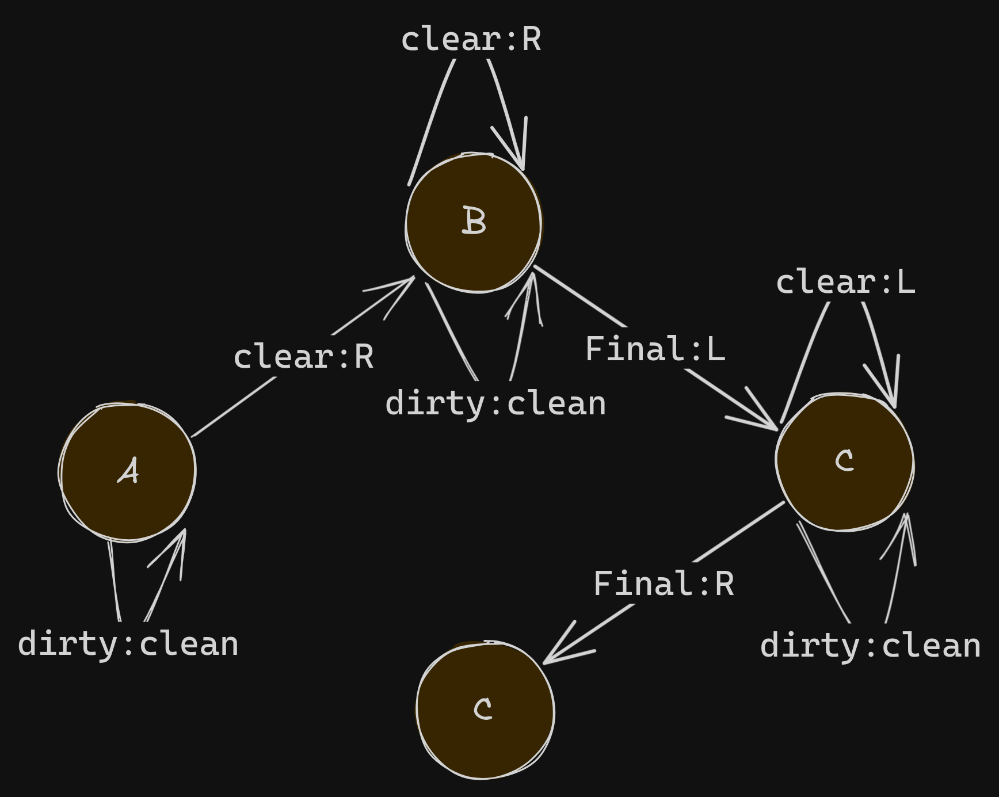

<head>
  <link rel="stylesheet" type="text/css" href="style.css">
</head>

<div class="container">
  <span class="spanStyle">
  	Aspiradora atutomatica 
  </span>
</div>

Proyecto para simular una aspiradora automatica que limpiara una serie de cuartos, a partir del supuesto de que hay un numero determinado habitaciones, y la posicion de esta es indeterminada asi camo su direccion.

## Automata usado para entender el problema
<raw>
   </img>
</raw>

**Donde:**
- clear es cambiar un 1 por un cero
- R es moverse a la derecha
- L es moverse a la izquierda
- dirty significa un 1 (habitacion sucia)
- clean significa un 0 (habitacion limpia)
- final significa un 2 (indica los extremos de las habitaciones)

## Codigo (Hecho en golang)

### Estructura instruc

Todo funciona a base de esat struct, conformada de un estado (definida por un enumerador), una action (definida por una funcion) y descridAction (identificador de accion definido por un Enumerador), y una implementacion que sirve para ejecutar la funcion action definida en el struct.  
```
type Instruct struct {
	state         EnumState
	action        func(pos *int, state EnumState, table *[]EnumState, prevPos int)
	describAction EnumDescribAction
}

func (i Instruct) execAction(pos *int, table *[]EnumState, prevPos int) {
	i.action(pos, i.state, table, prevPos)
}
```

## State
Listado de los posible estados de un instruct
```
type EnumState int

const (
	CLEAN EnumState = 0
	DIRTY EnumState = 1
)
```

## Action desriptor
Identificador del tipo de rol que cumple la funcion action en un instruct
```
type EnumDescribAction int

const (
	UNKNOWN EnumDescribAction = -1
	MOVE    EnumDescribAction = 0
	CLEAR   EnumDescribAction = 1
)
```

## Dirs
Define las posibles direcciones iniciales de la aspiradora
```
type EnumDir int

const (
	TOR EnumDir = -1
	TOL EnumDir = 1
)
```
### Definicion de funciones action
Se trata de las acciones que se ejecutaran seguna la instruct definida, en este caso son clear y move
```
func Movefunc(pos *int, state EnumState, table *[]EnumState, prevPos int) {
	var dir int = *pos - prevPos

	if dir < 0 {
		if *pos == 0 {
			*pos = *pos + 1
		} else {
			*pos = *pos - 1
		}
	} else {
		if *pos == len(*table)-1 {
			*pos = *pos - 1
		} else {
			*pos = *pos + 1
		}
	}
}

func Clearfunc(pos *int, state EnumState, table *[]EnumState, prevPos int) {
	(*table)[*pos] = CLEAN
}

```
### Matriz de instrucciones
La matriz que define la instrucciones que seguira la aspiradora segun el state en que se encuentre
```
var instructions = []Instruct{
	{CLEAN, Movefunc, MOVE},
	{DIRTY, Clearfunc, CLEAR},
}
```
## Action resolver
Esta funcion busca en la matriz de instrucciones a partir de un state dado.
```
func resolveAction(state EnumState, instructions []Instruct) Instruct {

	for _, ins := range instructions {

		if ins.state == state {
			return ins
		}
	}

	return Instruct{
		state:         -1,
		action:        func(pos *int, state EnumState, table *[]EnumState, prevPos int) {},
		describAction: UNKNOWN,
	}

}
```

### Tabla o cuartos
Se define un ejemplo para el escenario de la aspiradora, que se conforma del mismo enumerador que define los estados en instruc
```
table := []EnumState{DIRTY, CLEAN, DIRTY, DIRTY, DIRTY, DIRTY}
```

### Testing
Para hacer testing se ejecuta el comando:
`go test` o `ginkgo`
En el testing se incluyen varios casos posibles

### Running font code
Para ejecutar sin testing: `go run main.go`